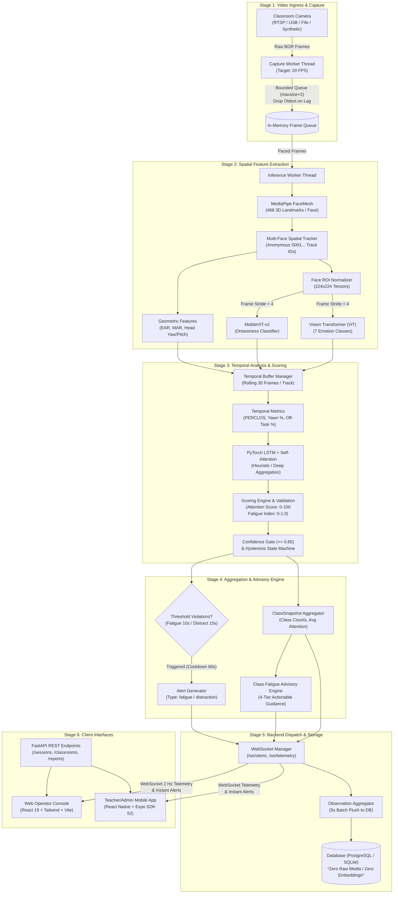
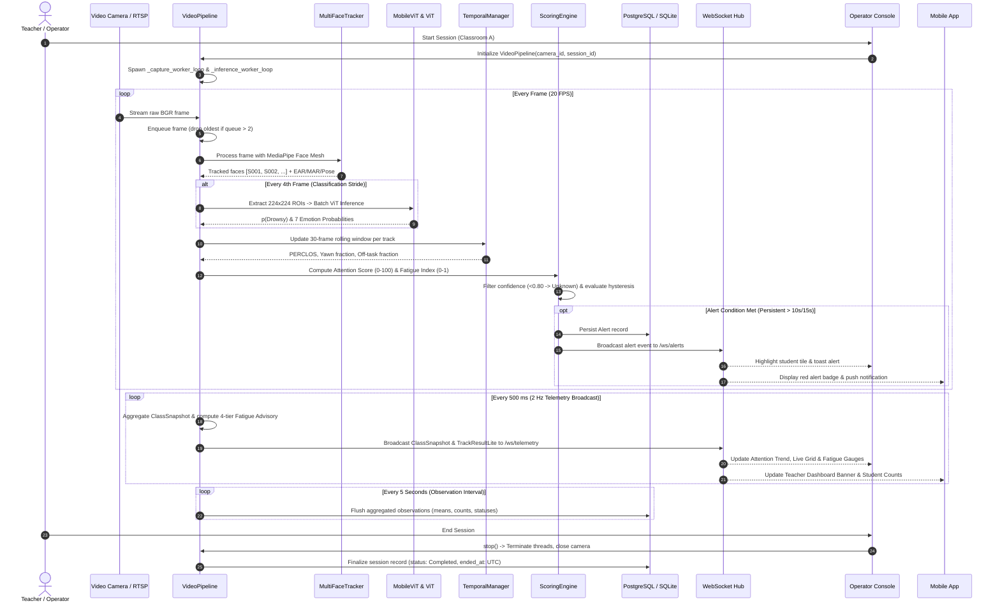
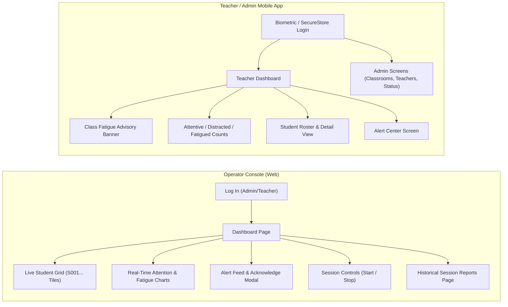

# System Flow & Runtime Execution Guide
## Student Attention & Fatigue Detection Platform

> **Comprehensive End-to-End Architectural Flow, Lifecycle Trace, and Operational Execution Runbook**  
> *Camera Ingress $\to$ Spatial Landmarking $\to$ Vision Transformer Inference $\to$ Temporal LSTM/Attention $\to$ Validation State Machine $\to$ FastAPI WebSocket/REST $\to$ Web Operator Console & Mobile Dashboard.*

---

## 1. Executive Architectural Overview

The **Student Attention & Fatigue Detection Platform** is a distributed edge-cloud AI system designed for real-time, non-intrusive classroom monitoring and student well-being indication. It continuously monitors classroom camera streams, detects and tracks multiple students anonymously (`S001`, `S002`, ...), extracts facial landmarks and deep spatial features, processes temporal behavioral patterns over time, and delivers validated indicators to educators and operators without persisting raw video or biometric identities.

### High-Level Architecture Diagram



---

## 2. Core Execution Lifecycle (Step-by-Step)

The end-to-end execution of the platform transitions through 12 deterministic stages from initial camera exposure to frontend telemetry rendering:



---

## 3. Deep-Dive Stage Execution Breakdown

### Stage 1: Video Ingress & Non-Blocking Acquisition
- **Component:** [`ai/pipeline.py:VideoPipeline`](file:///c:/Users/MANIKANDAN/OneDrive/Pictures/Desktop/Reverse%20Engineering/project/backend/ai/pipeline.py)
- **Thread Model:** Frame capture executes on a dedicated OS thread (`VideoPipeline-Capture`) to decouple network/hardware I/O jitter from inference latency.
- **Queue Buffering:** Uses a thread-safe `queue.Queue(maxsize=2)`. When the inference thread is under heavy GPU/CPU load, the capture thread automatically drops the oldest unconsumed frame (`queue.get_nowait()`), guaranteeing that inference **never lags behind real-time**.
- **Camera Liveness & Loss Watchdog:** If no frame arrives within `CAMERA_TIMEOUT_S = 10.0s`, the capture thread transitions `camera_state` from `Online` to `Offline`, triggers an `emit_camera_offline` system alert, and dispatches a updated `SystemStatus` payload over WebSockets.

### Stage 2: Multi-Face Landmark Tracking
- **Component:** [`ai/mediapipe_tracker.py:MultiFaceTracker`](file:///c:/Users/MANIKANDAN/OneDrive/Pictures/Desktop/Reverse%20Engineering/project/backend/ai/mediapipe_tracker.py)
- **Face Mesh Execution:** Executes MediaPipe Face Mesh on the BGR frame to extract 468 3D landmarks per detected face.
- **Identity Anonymization:** Generates ephemeral session IDs (`S001`, `S002`, ...). **No facial embeddings or biometric identities are computed or stored** (Mandate D5).
- **Geometric Landmark Features:**
  - **Eye Aspect Ratio (EAR):**
    $$\text{EAR} = \frac{|p_2 - p_6| + |p_3 - p_5|}{2 |p_1 - p_4|}$$
    Evaluated across eye landmarks (33, 160, 158, 133, 153, 144 for left; 362, 385, 387, 263, 373, 380 for right).
  - **Mouth Aspect Ratio (MAR):** Evaluated across lips (61, 291, 13, 14, 78, 308) to detect yawning.
  - **Head Pose Estimation:** 3D Perspective-n-Point (PnP) computes Yaw, Pitch, and Roll angles to measure off-task gaze or head drops.

### Stage 3: Deep Feature Extraction & Inference Striding
- **Components:**
  - [`ai/roi.py:FaceROIExtractor`](file:///c:/Users/MANIKANDAN/OneDrive/Pictures/Desktop/Reverse%20Engineering/project/backend/ai/roi.py)
  - [`ai/drowsiness.py:DrowsinessClassifier`](file:///c:/Users/MANIKANDAN/OneDrive/Pictures/Desktop/Reverse%20Engineering/project/backend/ai/drowsiness.py) (Pretrained `apple/mobilevitv2-1.0-imagenet1k-256`)
  - [`ai/expression.py:ExpressionClassifier`](file:///c:/Users/MANIKANDAN/OneDrive/Pictures/Desktop/Reverse%20Engineering/project/backend/ai/expression.py) (Pretrained `google/vit-base-patch16-224-in21k`)
- **ROI Normalization:** Bounding box regions of interest (ROI) are cropped with a 15% contextual margin, resized to $224 \times 224$, and normalized to PyTorch tensors.
- **Classification Frame Striding:** To maintain a 20 FPS pipeline across multi-student classrooms, heavy Vision Transformer inference runs once every $N=4$ frames (`classification_stride=4`). Intermediate frames reuse the cached class predictions while geometric landmarks update at full 20 FPS.

### Stage 4: Temporal Aggregation & Sequence Modeling
- **Component:** [`ai/temporal.py:TemporalManager`](file:///c:/Users/MANIKANDAN/OneDrive/Pictures/Desktop/Reverse%20Engineering/project/backend/ai/temporal.py)
- **Sliding History Window:** Maintains a ring buffer of the last $W=30$ frames (1.5 seconds at 20 FPS) for each active student track.
- **Aggregated Metrics:**
  - **PERCLOS:** Percentage of Eye Closure over the 30-frame window ($\text{EAR} < 0.20$).
  - **Yawn Fraction:** Fraction of frames with $\text{MAR} > 0.60$.
  - **Off-Task Fraction:** Fraction of frames with head yaw/pitch beyond attentiveness bounds ($|\text{yaw}| > 28^\circ$ or $\text{pitch} < -20^\circ$).
- **LSTM + Multi-Head Self-Attention:** [`ai/lstm_attention.py:LSTMAggregator`](file:///c:/Users/MANIKANDAN/OneDrive/Pictures/Desktop/Reverse%20Engineering/project/backend/ai/lstm_attention.py) processes the 30-step feature vector. When weights are uncalibrated, it defaults safely to `heuristic` mode (Mandate D10).

### Stage 5: Classification, Scoring & Confidence Gating
- **Component:** [`ai/scoring.py:ScoringEngine`](file:///c:/Users/MANIKANDAN/OneDrive/Pictures/Desktop/Reverse%20Engineering/project/backend/ai/scoring.py)
- **Attention Score (0 to 100):** Continuous score calculated from head pose alignment, eye engagement, and off-task penalty factors.
- **Fatigue Index (0.0 to 1.0):** Weighted combination of PERCLOS, Yawn fraction, and MobileViT drowsiness probability:
  $$\text{Fatigue Index} = 0.40 \times \text{PERCLOS} + 0.35 \times p(\text{Drowsy}) + 0.25 \times \text{Yawn Fraction}$$
- **Confidence Filtering:** If landmark tracking confidence or face visibility drops below `MIN_CONFIDENCE = 0.80`, the status immediately resolves to `Unknown`, preventing false accusations (Mandate D6).

### Stage 6: Alert Generation & Hysteresis State Machine
- **Non-Instantaneous Rule:** Alerts are **never** triggered by a single anomalous frame (Mandate D7).
- **Hysteresis State Machine:**
  - **Fatigue Alert:** Student must exhibit persistent fatigue indicators for $\ge 10.0$ consecutive seconds (`FATIGUE_PERSIST_S`).
  - **Distraction Alert:** Student must remain off-task for $\ge 15.0$ consecutive seconds (`DISTRACTION_PERSIST_S`).
  - **Status Hysteresis:** A student's status must remain stable for $\ge 3.0$ seconds (`STATUS_HYSTERESIS_S`) before the UI flips labels.
  - **Alert Cooldown:** Once an alert fires for track `S003`, subsequent alerts for `S003` are suppressed for $60.0$ seconds (`ALERT_COOLDOWN_S`).
- **Supportive Language:** Alerts strictly use non-diagnostic wording (Mandate D8): *"Repeated fatigue-related indicators during the current session."*

### Stage 7: Class-Level Fatigue Advisory Engine
- **Component:** [`app/advisory/engine.py:advisory_engine`](file:///c:/Users/MANIKANDAN/OneDrive/Pictures/Desktop/Reverse%20Engineering/project/backend/app/advisory/engine.py)
- Translates class-wide aggregate fatigue percentage into four actionable pedagogical interventions:

| Class Fatigue % | Tier Level | Action Code | Actionable Advisory Message |
|:---:|:---:|:---:|---|
| **0% to < 25%** | Level 1 | `CONTINUE` | *Continue with the class.* |
| **25% to < 50%** | Level 2 | `INTERACTIVE` | *Make the session more interactive.* |
| **50% to < 75%** | Level 3 | `SHORT_BREAK` | *Do a short activity or give a short break.* |
| **75% to 100%** | Level 4 | `RESCHEDULE` | *Most students show fatigue indicators. Consider continuing the class tomorrow.* |

- **Hysteresis & Damping:** Upgrades require 2 consecutive cycles (4s); downgrades require 3 consecutive cycles (6s) to prevent dashboard flicker.

### Stage 8: Real-Time Telemetry & WebSocket Dispatch
- **Component:** [`app/ws/manager.py:ConnectionManager`](file:///c:/Users/MANIKANDAN/OneDrive/Pictures/Desktop/Reverse%20Engineering/project/backend/app/ws/manager.py)
- **Channels:**
  - `/ws/telemetry`: Throttled to 2 Hz (`TELEMETRY_HZ = 2`). Dispatches `ClassSnapshot` and light `TrackResult` vectors.
  - `/ws/alerts`: Instantaneous push when an alert event is confirmed.
  - `/ws/video`: Video stream for Operator Console. **When `PRIVACY_MODE=true` (default), all connections are immediately rejected with WebSocket code `4403`**. Mobile devices receive 0% video under all configurations.

### Stage 9: Database Persistence & Data Retention
- **Component:** [`app/db/session_service.py`](file:///c:/Users/MANIKANDAN/OneDrive/Pictures/Desktop/Reverse%20Engineering/project/backend/app/db/session_service.py)
- **Batched Observation Flush:** Every 5.0 seconds (`OBSERVATION_INTERVAL_S`), the background service flushes aggregated student metrics (`attention_score_mean`, `fatigue_index_mean`, `confidence_mean`, frame counts) to the `observations` table.
- **Zero Raw Media Guarantee:** The database schema contains zero BLOB columns, zero image path columns, and zero biometric vectors (Mandate D4).
- **Auto-Purge Retention:** A scheduled background job purges all observation and alert records older than `RETENTION_DAYS = 180`.

---

## 4. Operational User Flows (Web vs. Mobile)



### Web Operator Console Flow
1. **Authentication:** User logs in at `/login` $\to$ receives JWT token stored in memory/session.
2. **Live Monitoring:** The `/` dashboard subscribes to `/ws/telemetry` for the active classroom session.
3. **Student Tiles:** Displays real-time cards for `S001`, `S002`, ... showing attention percentage, fatigue badge, and confidence indicator.
4. **Interactive Telemetry:** Live Recharts render a 60-second scrolling window of class attention trends and fatigue distribution.
5. **Alert Management:** The alert panel displays incoming alerts. Operators can click "Viewed" or "Resolve" to update the alert state via `PATCH /alerts/{id}`.
6. **Reporting:** Once a session ends, the operator navigates to `/reports` to view time-series engagement graphs and PDF summaries.

### Mobile App Flow (React Native / Expo)
1. **Teacher Overview:** Upon login, teachers immediately see their assigned classroom's current live session status.
2. **Prominent Fatigue Advisory:** The top banner displays the real-time pedagogical suggestion (e.g. *Level 3: "Do a short activity or give a short break"*).
3. **Push Notifications:** When persistent fatigue or distraction occurs, a native mobile push notification alerts the teacher immediately.
4. **Student Inspection:** Tapping a student shows anonymous trend metrics (`S004: Attention 88%, Status: Attentive`) without showing video or personal photos.
5. **Admin Console:** Administrators switch tabs to manage classrooms, assign teachers, inspect server health, and trigger data retention purges.

---

## 5. System Execution Runbook (Commands & Operations)

### 5.1 Prerequisites & Environment Setup

Ensure the host environment meets the baseline requirements:
- **Python:** 3.11+ (with `pip` and `venv`)
- **Node.js:** 20+ (with `npm`)
- **Docker & Docker Compose:** Required for containerized stack.

```bash
# Clone and enter directory
cd project

# Setup environment variables from template
cp .env.example .env
```

Key environment configurations in `.env`:
```ini
PRIVACY_MODE=true            # Enforces WebSocket video lockout (4403)
TARGET_FPS=20                # Target camera capture frame rate
TELEMETRY_HZ=2               # WebSocket broadcast rate (updates/second)
MIN_CONFIDENCE=0.80          # Confidence threshold for valid status
FATIGUE_PERSIST_S=10.0       # Consecutive seconds required to trigger fatigue alert
DISTRACTION_PERSIST_S=15.0   # Consecutive seconds required to trigger distraction alert
ALERT_COOLDOWN_S=60.0        # Alert suppression window per student
OBSERVATION_INTERVAL_S=5.0   # Observation batch flush frequency
RETENTION_DAYS=180           # Database retention limit
```

---

### 5.2 Method A: Full Dockerized Deployment (Recommended)

To launch the complete integrated system (PostgreSQL 16, FastAPI Backend, and Nginx Web Console):

```bash
# Build and start all services
docker compose up --build
```

**Service URLs:**
- **Web Operator Console:** [http://localhost:3000](http://localhost:3000) (or port 80)
- **FastAPI Backend & Swagger Docs:** [http://localhost:8000/docs](http://localhost:8000/docs)
- **Liveness Health Check:** [http://localhost:8000/health](http://localhost:8000/health)
- **PostgreSQL Database:** `localhost:5432` (`user:password@localhost:5432/classroom_monitoring`)

---

### 5.3 Method B: Native Local Development Execution

#### 1. Backend & AI Pipeline
```bash
cd backend

# Create and activate virtual environment
python -m venv .venv
# On Windows:
.\.venv\Scripts\activate
# On Linux / macOS:
source .venv/bin/activate

# Install dependencies
pip install -r requirements.txt

# Verify model weights or download if missing
python scripts/download_models.py
python scripts/verify_models.py

# Launch FastAPI application with Uvicorn
uvicorn app.main:app --host 0.0.0.0 --port 8000 --reload
```

#### 2. Web Operator Console
```bash
cd operator-console

# Install Node dependencies
npm install

# Launch Vite development server
npm run dev
# Running at: http://localhost:5173
```

#### 3. Mobile Application (React Native / Expo)
```bash
cd mobile

# Install Node dependencies
npm install

# Start Metro Bundler
npx expo start
# Press 'w' for web preview, 'a' for Android emulator, or scan QR code with Expo Go.
```

---

### 5.4 Test Suites & System Verification

The repository includes a complete suite of **150 automated tests** validating every layer:

```bash
# 1. Run all 111 Backend Unit, Integration, Stress, and Security Tests
cd backend
pytest tests -v

# 2. Run Operator Console Frontend Tests (23 Vitest/RTL tests)
cd ../operator-console
npm test

# 3. Run Mobile App Tests (16 Jest/RNTL tests)
cd ../mobile
npm test

# 4. Execute Full System Vulnerability & Privacy Audit
cd ../backend
python scripts/run_security_audit.py

# 5. Run Ultra-Scale 1,000-Face Live Benchmark
python scripts/run_1000_faces_detection.py
```

---

## 6. System Failover, Monitoring & Diagnostics

### State Transition & Health Matrix

| Event / Condition | Detection Mechanism | System Action & State Transition | Recovery Action |
|---|---|---|---|
| **Camera Feed Loss** | No frame in 10s (`CAMERA_TIMEOUT_S`) | `camera_state` $\to$ `Offline`. Broadcast `camera_offline` alert over `/ws/alerts`. Telemetry reflects zero detected students. | Worker thread continues polling `cv2.VideoCapture`. On reconnect, automatically switches state back to `Online`. |
| **AI Worker Hang** | No heartbeat in 10s (`AI_HEARTBEAT_TIMEOUT_S`) | Dispatches `ai_offline` alert to alert engine. Web & Mobile display red degraded status banner. | Internal loop self-restarts or supervisor process triggers container restart. |
| **High Processing Load** | Inference FPS < Capture FPS | Frame queue exceeds capacity (`maxsize=2`). Oldest unread frames are dropped immediately without crashing. | Classification frame striding maintains real-time throughput. |
| **Low Face Confidence** | Landmark confidence < 0.80 | Score engine suppresses classification; status marked as `Unknown`. Alert timers reset. | Restores to `Attentive`/`Normal` once student faces camera clearly. |
| **Unauthorized Video Request** | Client requests `/ws/video` while `PRIVACY_MODE=true` | Server forcefully rejects WebSocket connection with close code `4403`. | To enable video on Operator Console, administrator must explicitly set `PRIVACY_MODE=false` in `.env`. |

---

## 7. Architecture Summary & Compliance

- **No Face Recognition:** Tracks are anonymous (`S001` - `S1000`).
- **No Video Storage:** Zero frame storage on disk or database.
- **Supportive Indicators Only:** Educational assistance tool that informs rather than diagnoses.
- **Deterministic Latency Budget:** 20 FPS real-time execution with p95 pipeline latency $< 35\text{ ms}$.
